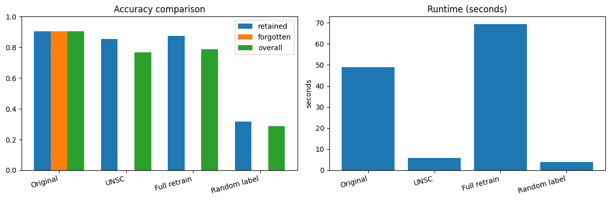

# Machine-Unlearning-Null-Space-Calibration

FastAPI-based proof-of-concept implementing **Machine Unlearning via Null Space Calibration (UNSC)** on **Fashion-MNIST**, designed for Apple Silicon with **PyTorch MPS**.

- **Paper used to build the POC**: [Machine Unlearning via Null Space Calibration (IJCAI 2024)](https://www.ijcai.org/proceedings/2024/0040.pdf)
- **Report notebook**: [`UNSC_FashionMNIST_Report.ipynb`](UNSC_FashionMNIST_Report.ipynb)

## Objective

Demonstrate **class-level unlearning**: after training an image classifier, forget one selected class while preserving behavior on the retained classes.

The repository provides:

- Training of an original model on full Fashion-MNIST
- UNSC class-forgetting using Algorithm 1 + Algorithm 2
- Baselines: full retrain and random-label fine-tuning
- Disk persistence for models, metrics, and UNSC artifacts

## What the UNSC paper is doing

The IJCAI 2024 paper targets a problem called **over-unlearning**. A normal unlearning update may erase the requested class, but it can also damage the model's behavior on classes that should remain. UNSC fixes this by making the update happen only in directions that are invisible, or close to invisible, to retained-class samples.

The idea has two moving parts:

1. **Null-space unlearning**
   - For each layer, collect the activations/input features produced by retained classes.
   - Use SVD to estimate the subspace where retained-class gradients live.
   - Build a projector onto the orthogonal complement of that retained subspace:

     `P_l = I - Q_l Q_l^T`

   - During unlearning, replace each raw gradient with its projected version, so the update changes the forget class while mostly avoiding directions used by retained classes.

2. **Decision-space calibration with pseudo-labels**
   - Forgotten samples are not trained with their true label.
   - The frozen original model `theta_o` predicts the most likely retained class for each forgotten sample.
   - That retained class becomes the pseudo-label:

     `y_hat = argmax_{c != forget_class} f(x; theta_o)_c`

   - This makes the unlearned model behave more like a retained-only retrained model: forgotten samples are absorbed into nearby remaining classes rather than preserved as their original class.

In paper terms, Algorithm 1 finds layer-wise class subspaces, and Algorithm 2 performs pseudo-label unlearning while projecting gradients through the null-space projector. The paper reports utility using retained-test accuracy and forgotten-test accuracy: good unlearning should keep retained accuracy high while driving forgotten-class accuracy toward zero.

## UNSC in this repo

This project is a small, API-first proof-of-concept of that paper on **Fashion-MNIST** using a custom `FashionCNN`. It focuses on class-level unlearning: choosing one Fashion-MNIST label from `0..9` and unlearning all training samples from that class.

Fashion-MNIST class ids:

| ID | Class |
|----|-------|
| 0 | T-shirt/top |
| 1 | Trouser |
| 2 | Pullover |
| 3 | Dress |
| 4 | Coat |
| 5 | Sandal |
| 6 | Shirt |
| 7 | Sneaker |
| 8 | Bag |
| 9 | Ankle boot |

### Algorithm 1 - Subspaces + projectors (cached)

- Implemented mainly in [`app/unlearn.py`](app/unlearn.py) and [`app/model.py`](app/model.py).
- `FashionCNN` exposes hook points for `conv1`, `conv2`, `fc1`, and `fc2`.
- For each class, the app collects layer input columns. Conv layers are converted to patch columns using `torch.nn.functional.unfold`, matching the paper's convolution-as-matrix-multiplication note.
- Each class/layer matrix is decomposed with SVD.
- `epsilon_trunc_class` keeps enough singular-vector energy for each per-class basis.
- Retained-class bases are merged for the selected forget class.
- `epsilon_union_layer` keeps enough merged energy before building each per-layer null-space projector:

`P_l = I - Q_l Q_l^T`

- Saved artifacts:
  - `outputs/unsc_subspaces_*.pt` (+ `.meta.json`)
  - `outputs/projection_*.pt`

### Algorithm 2 - Projected unlearning with pseudo-labels

- Implemented in `run_unsc(...)` in [`app/unlearn.py`](app/unlearn.py).
- Copy original weights `theta_o` into a student model `theta_u`.
- For each forgotten sample, generate a pseudo-label from the frozen original model excluding the forget class `f`:

`y_hat = argmax_{c != f} theta_o(x)_c`

- Train only on forgotten-class batches using pseudo-label cross entropy.
- After `loss.backward()`, project Conv/Linear weight gradients through the cached projectors.
- Save the resulting unlearned model and evaluate it on full, retained, and forgotten test splits.
- Saved artifacts:
  - `saved_models/unlearned_unsc_c<f>.pt`
  - `outputs/results.json`
  - `outputs/run_<run_id>.json`

### Baselines

- **Full retrain**: trains a fresh `FashionCNN` from scratch using only retained training samples. This is the gold-standard comparison, but slower.
- **Random label**: copies `theta_o`, fine-tunes on forgotten samples with random labels from retained classes, and does not use null-space projectors. It is fast, but usually hurts retained accuracy.

### Important implementation differences from the paper

- The paper evaluates several datasets and architectures. This repo intentionally keeps the demo to Fashion-MNIST and a small CNN.
- The paper uses larger training schedules. The API defaults are lighter so demos finish faster.
- This repo reports overall, retained, and forgotten accuracies. It does not implement the paper's membership inference attack metric.

## Repository structure

```text
.
├── app/
│   ├── baselines.py
│   ├── data_loader.py
│   ├── evaluate.py
│   ├── main.py
│   ├── model.py
│   ├── results.py
│   ├── schemas.py
│   ├── state.py
│   ├── train.py
│   └── unlearn.py
├── docs/report/                   # Figures for README / GitHub (e.g. accuracy comparison)
├── UNSC_FashionMNIST_Report.ipynb  # Analysis + plotting + inference demo
├── app.py                         # Uvicorn entry point
├── outputs/                       # Generated artifacts (created at run time)
├── saved_models/                  # Generated checkpoints
├── data/                          # Fashion-MNIST download cache (gitignored)
└── requirements.txt
```

## Setup

```bash
python3 -m venv .venv
source .venv/bin/activate
pip install -r requirements.txt
```

## Run the API

```bash
python3 app.py
```

Open Swagger UI at [http://127.0.0.1:8000/docs](http://127.0.0.1:8000/docs).

## Suggested API flow

1. `POST /model/train` — train or warm-load original model `θ_o`
2. `POST /unlearn/select-class` — choose forget class (`0..9`)
3. `POST /unlearn/run` — run UNSC unlearning
4. `POST /baseline/retrain` — full retrain baseline
5. `POST /baseline/random-label` — random-label baseline
6. `GET /results/compare` — latest metrics table
7. `GET /model/evaluate?scope=original|current` — evaluate saved models

## API curl examples

Set a base URL once:

```bash
BASE_URL="http://127.0.0.1:8000"
```

### Health check

```bash
curl -s "$BASE_URL/"
```

Expected shape:

```json
{"service":"unsc-fashion-mnist","status":"healthy"}
```

### Dataset metadata

```bash
curl -s "$BASE_URL/dataset/info"
```

### Train or warm-load the original model

The first call downloads Fashion-MNIST into `data/` if needed. If `saved_models/original_model.pt` already exists and `force_retrain` is `false`, the API warm-loads it.

```bash
curl -s -X POST "$BASE_URL/model/train" \
  -H "Content-Type: application/json" \
  -d '{
    "dataset": "fashion_mnist",
    "epochs": 15,
    "batch_size": 128,
    "learning_rate": 0.05,
    "seed": 42,
    "force_retrain": false
  }'
```

To force a new original model:

```bash
curl -s -X POST "$BASE_URL/model/train" \
  -H "Content-Type: application/json" \
  -d '{
    "dataset": "fashion_mnist",
    "epochs": 15,
    "batch_size": 128,
    "learning_rate": 0.05,
    "seed": 42,
    "force_retrain": true
  }'
```

### Select a forget class

Example: forget class `0`, which is `T-shirt/top`.

```bash
curl -s -X POST "$BASE_URL/unlearn/select-class" \
  -H "Content-Type: application/json" \
  -d '{"forget_class": 0}'
```

### Run UNSC unlearning

This uses the server-selected forget class. You can also pass `"forget_class": 0` directly in this body to override the stored selection.

```bash
curl -s -X POST "$BASE_URL/unlearn/run" \
  -H "Content-Type: application/json" \
  -d '{
    "epochs": 3,
    "learning_rate": 0.01,
    "batch_size": 128,
    "subspace_samples_per_class": 256,
    "epsilon_trunc_class": 0.97,
    "epsilon_union_layer": 0.97,
    "momentum": 0.9,
    "seed": 42
  }'
```

### Full retrain baseline

This trains a new model only on retained classes.

```bash
curl -s -X POST "$BASE_URL/baseline/retrain" \
  -H "Content-Type: application/json" \
  -d '{
    "forget_class": 0,
    "epochs": 15,
    "learning_rate": 0.05,
    "batch_size": 128,
    "momentum": 0.9,
    "seed": 42
  }'
```

### Random-label baseline

This requires `theta_o`, so call `/model/train` first.

```bash
curl -s -X POST "$BASE_URL/baseline/random-label" \
  -H "Content-Type: application/json" \
  -d '{
    "forget_class": 0,
    "epochs": 15,
    "learning_rate": 0.05,
    "batch_size": 128,
    "momentum": 0.9,
    "seed": 42
  }'
```

### Evaluate the original model

```bash
curl -s "$BASE_URL/model/evaluate?scope=original"
```

### Evaluate the current model

`current` means the latest in-memory student model, usually UNSC or random-label after those routes run. If no student exists, the app mirrors `theta_o`.

```bash
curl -s "$BASE_URL/model/evaluate?scope=current"
```

### Compare latest results

```bash
curl -s "$BASE_URL/results/compare"
```

## Results

After running the flow above (example: forget class **0**), overall / retained / forgotten test accuracy and wall-clock time compare as follows. **UNSC** keeps retained accuracy close to **full retrain** while collapsing performance on the forgotten class, with much less runtime than retraining; **random label** is fast but destroys retained accuracy.



| Method | Overall acc. | Retained acc. | Forgotten acc. | Runtime (s) |
|--------|--------------|---------------|----------------|-------------|
| Original | 0.905 | 0.905 | 0.905 | ~49 |
| UNSC | 0.768 | 0.854 | ~0.001 | ~6 |
| Full retrain | 0.786 | 0.874 | 0.0 | ~69 |
| Random label | 0.286 | 0.318 | 0.0 | ~3.8 |

## Persistence outputs

- `outputs/results.json` (aggregate runs)
- `outputs/run_<run_id>.json` (per-run curves and metadata)
- `outputs/unsc_subspaces_*.pt` + `.meta.json` (Algorithm 1 caches)
- `outputs/projection_*.pt` (per-layer projectors)
- `saved_models/original_model.pt`
- `saved_models/unlearned_unsc_c<f>.pt`
- `saved_models/retrained_c<f>.pt`
- `saved_models/random_label_c<f>.pt`

## References

- [Machine Unlearning via Null Space Calibration (IJCAI 2024)](https://www.ijcai.org/proceedings/2024/0040.pdf)
